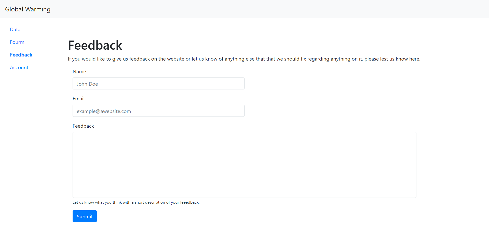

# Omega
## Fall 2020
## Overview
Our application Global Warming lets people see the information about global warming and some of
the impacts that it could make to our society. There is also a forum where people will be able
to converse about the current state and where the world can go from here. There are accounts that
let each person post and comment in the forum page. Finally there is a feedback page that can be
used to help us make sure the website is working and for any suggestions that come our way. The 
feedback can also let users message us if they are having any other problems with their account
or other things that may occur.

## Team Members
Dylan Martin: DylanMartin2523

Brent Kohl: bkohl33

## User Interface
### Persistent Side Bar
This is the side bar that enables navigation between the different sections of the website. The current section the user is on is bolded.

### Forum:
#### forum.html
The forum page consists of a a main forum area which displays all of the posts people have made. Each post container includes a button that takes the user to the comments section
of the corresponding forum post. There is also a button that allows the user to create a new post.

#### forum-comments.html
This page accessible by clicking on a comments button from the main forum page. This page contains the post, its body and the comments users have left on the post. There is a button that allows the user to create a top level comment on the post. There is also a small reply button on each comment that allows the user to make a nested reply to a comment. The user has to press a submit button to post a nested comment.
To the right of the page is a button that will take the user back to the main forum page. In the bottom right the user is able to delete the post provided that they are signed in as the user who made the post.

#### createComment.html
This page contains a text box and a submit comment button. The text box is to record the user's comment and the submit comment button adds the comment as a top level comment on 
on the post.

#### createPost.html
This page contains two text boxes and a submit post button. The text boxes record the title and the body of the post. The submit post button allows the user to send their post to the main forum page.

### Account:
#### login.html
This page has two sections. The first section allows the user to make a new account as long as the username is unique. This side has two text boxes, one for username and one for password as well as a button that allows the user to create an account. The second section allows the user to sign in providing their credentials are correct. This section has the same layout as the first section except for a 'Login' button instead of a 'Create Comment' button.

### Feedback:
#### feedback.html
The feedback page is the main page to let us know what people think of the application
and is set up in an easy to use format. There are inouts for the each the name, email,
and the feedback that they want to give. When the button is pressed, it submits the form.

## APIs
#### /createUser
Attempts to add user. Either responds with 'Username Taken' if the attempted username is taken or returns a userid that the user uses for authentication in other parts of the site.
#### /login
Checks if the provided credentials are valid and if they are it returns a userid that the user uses for authentication in other parts of the site. Otherwise sends back 'Username Invalid'.
#### /createComment
Sends comment data to database.
#### /createPost
Sends post data to the database.
#### /users
Returns database collection of users which includes userids, hashed passwords and salt.
#### /forum
Returns database collection of all posts. 
#### /deletePost?id={postid}
Removes post from database with id of postid.
#### /forum-comments?id={postid}
Returns forum post data which includes the post title and body and all comments.
#### /feedback
This send the data from the feedback page to the server and logs it.
There is also a function to let us get the feedback from the server.

## Database
Users Users { _id: , name: String, // Username of user pass: String, // Password of user salt: String // Salt used for password }

Posts Comments { _id: , id: String, // Commenter UserID body: String, // Body of comment resTo: String, // Comment id of parent comment '0' if no parent postId: String // id of the post }

Posts Posts { _id: , userid: String, // Userid of poster body: String, // Body of post title: String // title of post }

Feedback Feedback{ _id: , id: String, //feedback id feed: String //The feedback body }
## URL Routes/Mappings

## Authentication/Authorization
This site uses mongodb so the password for database access is saved in the mongodb environment variables. When the user creates an account their password is salted and hashed using minicrypt. The hash and salt are then stored in the user data in the database. To authenticate a user when the user logs in the provided password is checked against the hash on the database. The server returns an id that is then saved in the localStorage so the user can be authorized for actions later.  
## Division of Labor
Brent: All of the Feedback page for the project including the front and back end.
## Conclusion
