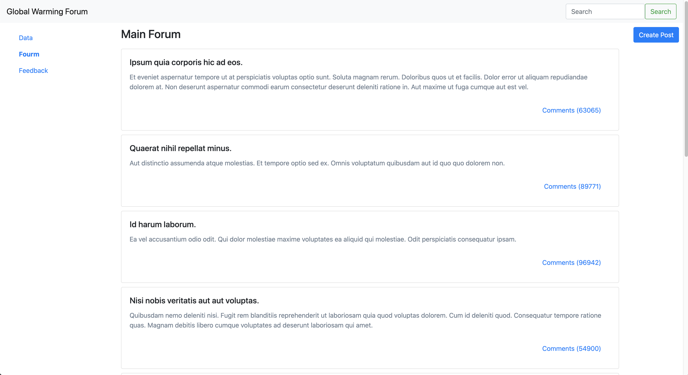
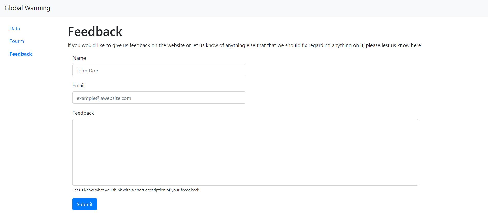
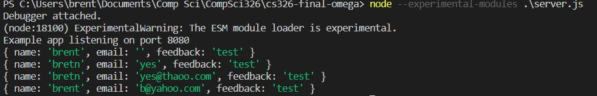

# API 
### Forum Endpoints
/forum pulls all existing forum posts and displays them on the page.
/forum-comments/<forumIDNum> pulls all existing comments for a specific forum post and displays the comments.
/createComment/<fourmIDNum> pushes what the user writes in the comment and user name section and sends it to the server so others can then see it
/createPost pushes a new forum post created from the data supplied on the webpage.
  
### Feedback Endpoints
/feedback takes in the data from the form and clears it when it finishes. It then pushes it to the server and can be read on the localhost/feedback.

# Screenshots
## Main Forum Page

## Feedback Page

# Heroku
https://global-warming-cs326.herokuapp.com/

# Labor Division
Dylan: All forum related stuff
